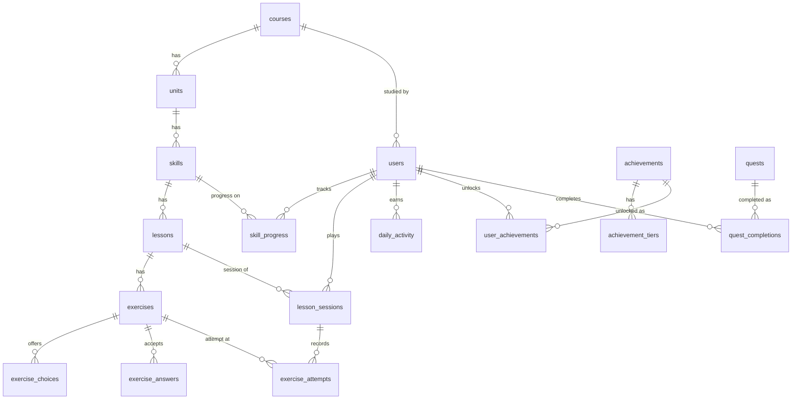

# Duolingo Clone

A functional clone of the Duolingo web app: a winding learning path, a lesson player with five
exercise types, and the gamification loop around it (XP, streaks, hearts, gems, quests,
achievements and a weekly league).

- **Frontend:** Next.js 15 (App Router) · TypeScript · Tailwind CSS · SWR
- **Backend:** Python · FastAPI · SQLAlchemy 2
- **Database:** SQLite (schema and seed data created automatically on first start)

```
frontend/   Next.js app (UI only; all state lives behind the API)
backend/    FastAPI app, SQLite schema, seed data, tests
```

---

## Quick start

Requires **Python 3.11+** and **Node.js 18.18+**. Run the two apps in separate terminals.

### 1. Backend (http://localhost:8000)

```bash
cd backend
python -m venv .venv
# Windows:  .venv\Scripts\activate
# macOS/Linux:  source .venv/bin/activate
pip install -r requirements.txt
uvicorn app.main:app --reload --port 8000
```

The first start creates `backend/duolingo.db` and seeds it with a Spanish course, a sample
learner and twelve league rivals. Interactive API docs: http://localhost:8000/docs

### 2. Frontend (http://localhost:3000)

```bash
cd frontend
npm install
cp .env.example .env.local      # optional: only needed if the API is not on localhost:8000
npm run dev
```

Open http://localhost:3000. You are signed in as the seeded learner; there is no login.

### Useful commands

| Command | Where | What it does |
| --- | --- | --- |
| `pytest` | `backend/` | Runs the 41 backend tests (rules, the full lesson loop and the challenge modes, through the API) |
| `python -m app.seed --reset` | `backend/` | Drops everything and re-seeds |
| `npm run build` | `frontend/` | Production build (includes the TypeScript check) |
| `npm run typecheck` | `frontend/` | TypeScript only |

### A two-minute tour

1. **Learn**: the seeded learner has finished one skill and is 1/3 through the next. Click the
   node with the progress ring, then **START**.
2. Play the lesson. Answer something wrong on purpose: you lose a heart, see the red feedback
   bar, and the exercise comes back at the end. Number keys pick options; **Enter** checks.
3. Finish to see XP, accuracy and (once per day) the streak screen.
4. **Settings -> Developer tools**: *Go to tomorrow* and *Skip a day* move the learner's clock so
   you can watch the streak continue or reset, hearts regenerate and daily quests roll over.
5. Lose all five hearts to get the out-of-hearts modal: refill with gems, or practice to earn
   one back.
6. Click the finished (ticked) node and choose **LEGENDARY**: an extra-hard replay where three
   mistakes end the attempt. Win it and the node turns gold.
7. **Practice -> Timed practice** races a two-minute clock; **GUIDEBOOK** on the unit banner lists
   the unit's phrases and words; **REVIEW LESSON** on the completion screen shows every answer.
8. **Settings -> Test audio** plays a sound effect and the Spanish voice, and says so if this
   browser has no Spanish voice installed.

---

## Features

| Area | What is implemented |
| --- | --- |
| **Learning path** | Units with their own colour, winding nodes, completed / current / locked states, progress ring per skill, reward chests, sticky unit banner that follows scrolling, node popovers (start, practice, locked) |
| **Lesson player** | Multiple choice (picture cards and text), translate with a word bank, match pairs, fill in the blank, type the answer; progress bar; feedback bar; "N in a row" streaks with mascot interstitials; missed exercises are replayed at the end; quit-confirmation modal; lesson review |
| **Legendary challenge** | Offered when a skill is finished ("Prove you're a legend") and from any completed node: ten of the skill's hardest exercises, three mistakes allowed, +40 XP, and the node turns gold with a crown |
| **Timed practice** | A mixed practice set against a two-minute clock enforced by the server; mistakes cost time, not hearts; +20 XP for beating it |
| **Guidebook** | Each unit's key phrases and vocabulary (with pictures and audio), derived from the unit's own exercises |
| **Hearts** | Lose one per wrong answer; lesson stops at zero; regenerate over time (1 per 4 h, configurable); refill for gems; practice to earn one back |
| **XP and streak** | 10 XP per lesson (+5 for no mistakes), 5 XP per practice; streak grows once per calendar day and resets after a missed day; week calendar |
| **Daily goal and quests** | Daily XP goal (10/20/30/50) shown as the first of three daily quests; quests pay gems once per day |
| **Leaderboard** | Weekly league ranked by XP earned since Monday across the learner and seeded rivals, whose XP keeps moving day to day |
| **Achievements** | Six tiered achievements (streak, XP, lessons, perfect lessons, levels, Legendary levels) with unlock toasts |
| **Profile, shop, settings** | Stats and achievements; heart refill purchase; name, daily goal, sound, speech, animation and theme preferences; audio test |
| **Audio** | Spanish words, prompts and answers are read aloud; synthesised chimes for correct, wrong, match, completion and rewards |
| **Bonus items** | All six from the brief: audio, achievements, a live leaderboard, timed practice and the Legendary challenge, dark and light themes, responsive layout (sidebar, icon rail, bottom tabs) |

**Placeholders** (shown in the UI, answer with a "Coming soon" toast, as the brief allows):
Super subscription, speaking/listening exercises, friends and followers, additional courses,
streak freeze, jumping ahead to later units, and account settings.

---

## Architecture

```
Browser ── Next.js (static pages + client components)
              │  fetch / SWR cache
              ▼
          FastAPI  ─ routers (HTTP) ─ services (rules) ─ SQLAlchemy models ─ SQLite
```

### Backend (`backend/app`)

| Path | Responsibility |
| --- | --- |
| `main.py` | App factory, CORS, router registration, seed-on-first-start |
| `models.py` | The database schema (17 tables) |
| `schemas.py` | Pydantic request / response models: the API contract |
| `routers/` | Thin HTTP handlers; each one calls a service and commits |
| `services/` | All business rules, one module per concern: `sessions` (lesson loop and its four modes), `grading`, `hearts`, `streak`, `path`, `guidebook`, `quests`, `achievements`, `leaderboard`, `shop`, `users` |
| `clock.py` | "Now" for a learner, including the simulated day offset |
| `seed/` | `content.py` holds vocabulary and sentences; `builder.py` generates exercises from them; `run.py` writes everything to the database |
| `tests/` | `test_rules.py` (pure rules), `test_api.py` (lesson loop and gamification through HTTP), `test_challenges.py` (Legendary, timed practice, guidebook, review) |

Design decisions worth knowing:

- **The server is authoritative.** Exercises are sent without their answer keys. Each answer is
  posted to the API, graded there, and hearts are deducted there. A session can only be
  completed once every exercise in it has a correct attempt, so XP cannot be claimed by skipping
  exercises. (Match pairs is the one exception: pair membership is sent so taps can be validated
  instantly; the finished set is still verified by the server.)
- **Rules are pure functions where possible** (`hearts`, `streak`, `grading`), which keeps them
  easy to unit test without HTTP or a database.
- **Time is lazy, not scheduled.** Hearts regenerate and streaks expire by comparing timestamps
  when data is read; there is no background worker.
- **Content is generated, not hand-typed.** Authors write words and sentences; the builder turns
  each skill into three lessons that move from recognition to production, with a fixed random
  seed so the course is identical on every run (39 lessons, 318 exercises).
- **One loop, four modes.** A lesson, a practice set, a Legendary challenge and timed practice
  are all the same session flow; the mode only decides which exercises are chosen and what is at
  stake (hearts, a mistake allowance, or a deadline), so each new mode was a small addition.
- **No migrations.** The database only holds seeded demo data, so a schema change bumps
  `SCHEMA_VERSION` (stored in SQLite's `user_version`) and the file is rebuilt on next start.

### Frontend (`frontend/src`)

| Path | Responsibility |
| --- | --- |
| `app/(main)/*` | Pages that share the sidebar shell: learn, practice, leaderboard, quests, shop, profile, settings |
| `app/lesson` | The full-screen lesson player route |
| `components/learn` | Path nodes, popovers, unit banner |
| `components/lesson` | `lesson-state.ts` (the lesson loop as a pure reducer), `LessonPlayer` (wires it to the API), header, footers, end screens, and one component per exercise type under `exercises/` |
| `components/layout` | Sidebar, mobile tab bar, stats bar with popovers, right-rail cards |
| `components/ui` | Button, Modal, ProgressBar, Toast |
| `components/icons.tsx`, `Mascot.tsx`, `Character.tsx` | Original inline-SVG artwork |
| `lib/` | Typed API client, SWR hooks, device preferences, theme constants, `sfx.ts` (sound-effect synthesis) and `audio.ts` (playback and Spanish speech) |

- **Server state** is cached with SWR, keyed by API path. Mutations return the fresh learner
  summary, which is written straight into the cache.
- **The lesson loop is a reducer** (`loading -> answering -> feedback -> interstitial -> ... ->
  complete`), separate from rendering and from network calls.
- **Theming** uses CSS variables switched by `data-theme`, exposed to Tailwind as semantic
  colours (`bg`, `surface`, `line`, `ink`, `primary`, ...).

---

## Database schema

Two groups of tables: seeded course content, and learner state.



### Course content

| Table | Purpose | Key columns |
| --- | --- | --- |
| `courses` | A language course | `title`, `language_code`, `source_language_code` |
| `units` | A coloured section of the path | `course_id`, `section_index`, `order_index`, `title`, `color` |
| `skills` | One path node: a set of lessons, or a chest | `unit_id`, `order_index`, `kind` (lesson/chest), `icon`, `reward_gems` |
| `lessons` | One sitting within a skill | `skill_id`, `order_index`, `xp_reward` |
| `exercises` | One question | `lesson_id`, `order_index`, `type`, `instruction`, `prompt_text`, `prompt_language`, `prompt_translation`, `character`, `is_new_word` |
| `exercise_choices` | Options, word-bank tiles or pair halves | `exercise_id`, `text`, `language`, `image`, `is_correct`, `pair_key` |
| `exercise_answers` | Accepted free-form answers | `exercise_id`, `text`, `is_primary` |

### Learner state

| Table | Purpose | Key columns |
| --- | --- | --- |
| `users` | Learner (and seeded rivals, `is_bot`) with gamification totals | `total_xp`, `gems`, `hearts`, `hearts_updated_at`, `streak`, `longest_streak`, `last_active_date`, `daily_goal_xp`, `league`, `day_offset` |
| `skill_progress` | Progress on a node | `user_id`, `skill_id`, `lessons_completed`, `completed_at`, `legendary_at` |
| `lesson_sessions` | One run through a lesson, practice set or challenge | `user_id`, `lesson_id`, `skill_id`, `mode`, `status`, `exercise_ids`, `mistakes_allowed`, `expires_at`, `xp_earned`, `accuracy` |
| `exercise_attempts` | Every graded answer | `session_id`, `exercise_id`, `is_correct`, `answer` |
| `daily_activity` | Per-day totals: drives streak calendar, daily goal, quests, weekly league | `user_id`, `activity_date`, `xp_earned`, `lessons_completed`, `perfect_lessons` |
| `achievements`, `achievement_tiers` | Achievement definitions and their thresholds | `metric`, `level`, `threshold` |
| `user_achievements` | Highest tier unlocked | `user_id`, `achievement_id`, `level` |
| `quests` | Daily quest definitions | `metric`, `target`, `reward_gems` |
| `quest_completions` | Marks a quest as paid for a day | `user_id`, `quest_id`, `quest_date` |

Integrity is enforced in the schema: foreign keys with cascades (SQLite's `PRAGMA
foreign_keys` is switched on per connection), unique constraints on every ordering and on
`(user, skill)`, `(user, date)`, `(user, quest, date)`, and check constraints keeping hearts,
gems and XP non-negative.

---

## API overview

All routes are JSON under `/api`. Errors have the shape
`{"detail": {"code": "no_hearts", "message": "You ran out of hearts!"}}`.

| Method | Path | Description |
| --- | --- | --- |
| GET | `/api/me` | Learner summary: hearts (with time to next), streak and week calendar, XP, gems, daily goal |
| PATCH | `/api/me` | Update display name or daily XP goal |
| GET | `/api/profile` | Summary plus lifetime statistics and achievements |
| GET | `/api/path` | Units and nodes with completed / current / locked status |
| GET | `/api/units/{id}/guidebook` | Key phrases and vocabulary taught in a unit |
| POST | `/api/skills/{id}/claim` | Open a reward chest |
| POST | `/api/sessions` | Start a session (`mode`: `lesson`, `practice`, `legendary` or `timed`); returns the exercises |
| POST | `/api/sessions/{id}/answers` | Grade one answer; a wrong answer costs a heart in a lesson, or a mistake in a Legendary challenge |
| POST | `/api/sessions/{id}/complete` | Award XP, advance the skill, update streak, quests and achievements |
| GET | `/api/sessions/{id}/review` | Every exercise of a session with its solution and first-try result |
| POST | `/api/sessions/{id}/abandon` | Quit early with no rewards |
| GET | `/api/leaderboard` | This week's league standings |
| GET | `/api/quests` | Today's quests and progress |
| GET | `/api/shop` | Shop items and availability |
| POST | `/api/shop/purchase` | Spend gems (heart refill) |
| POST | `/api/dev/advance-day` | Move the learner's clock forward (testing aid) |
| POST | `/api/dev/reset` | Wipe and re-seed (testing aid) |
| GET | `/api/health` | Liveness check |

An answer submission uses the field that matches the exercise type:

```jsonc
{ "exercise_id": 12, "choice_id": 40 }              // multiple_choice, fill_blank
{ "exercise_id": 13, "choice_ids": [51, 49, 52] }   // word_bank (tiles in order)
{ "exercise_id": 14, "text": "A coffee, please." }  // type_answer
{ "exercise_id": 15, "pairs": [[60, 65], [61, 64]] } // match_pairs
{ "exercise_id": 12, "skipped": true }              // SKIP button
```

---

## Deployment

The two apps deploy independently.

- **Backend** (Render, Railway, or any Python host): root directory `backend`, build command
  `pip install -r requirements.txt`, start command
  `uvicorn app.main:app --host 0.0.0.0 --port $PORT`. Set `CORS_ORIGINS` to the frontend's URL.
- **Frontend** (Vercel or Netlify): root directory `frontend`, and set `NEXT_PUBLIC_API_URL` to
  the backend's URL.

On hosts with an ephemeral filesystem the SQLite file is recreated and re-seeded whenever the
service restarts; attach a persistent disk and point `DATABASE_URL` at it to keep progress.

---

## Assumptions

- **One default learner.** Authentication is out of scope, so every request acts as the seeded
  learner. Rivals on the leaderboard are seeded bot users in the same `users` table.
- **Days are UTC.** Streaks, daily quests and the weekly league use the server's UTC date.
- **Simulated time.** Each learner has a `day_offset` so day-based behaviour can be demonstrated;
  the developer tools in Settings exist for reviewers and would not ship.
- **Typed answers are forgiving.** Case, accents and punctuation are ignored, listed alternative
  translations are accepted, and a single typo in a longer answer is allowed (with a notice).
- **Match pairs cannot cost a heart.** A wrong pair shakes and can be retried, as in the real app.
- **XP in the top bar.** The brief asks for XP there, so it sits alongside the streak, gems and
  hearts shown by the real app.
- **Artwork and fonts.** Duolingo's illustrations and typeface are proprietary, so the mascot,
  characters and icons are original SVGs drawn for this project, and
  [Nunito](https://fonts.google.com/specimen/Nunito) (SIL Open Font License) stands in for the
  product font. The layout, colours and interactions follow the real app's dark theme.
- **Audio ships no files.** Sound effects are synthesised with Web Audio. Spanish is read by the
  browser's speech synthesis using an installed Spanish voice (Chrome and Edge include one). A
  browser without one stays silent rather than mispronouncing Spanish with an English voice,
  hides the listen buttons, and says so under Settings -> Test audio.
- **Challenge rules.** Legendary: ten exercises, three mistakes, no hearts involved, and it can
  be retried freely. Timed practice: 120 seconds, checked by the server with a three-second
  allowance for network latency.

## Credits

Vocabulary illustrations in `frontend/public/images/vocab` are from
[Twemoji](https://github.com/jdecked/twemoji), licensed CC-BY 4.0.
